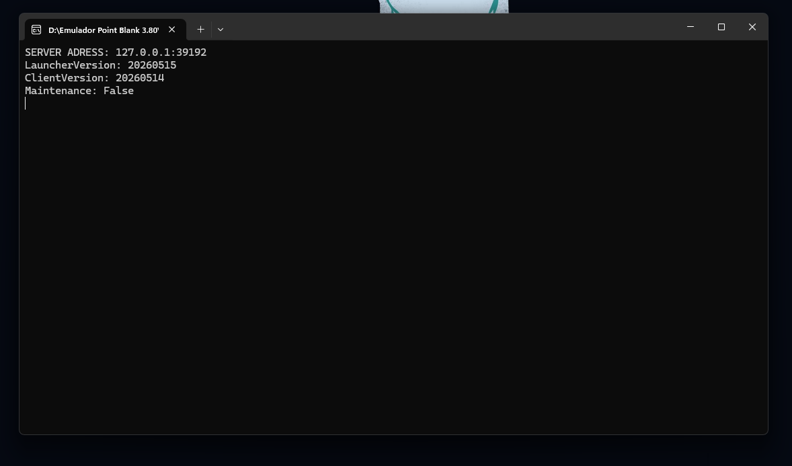

# Point Blank Launcher

Sistema de launcher para o emulador **Point Blank 3.80**, composto por quatro projetos integrados: cliente visual, serviço TCP, gerenciador de configurações e criador de pacotes de atualização.

---

## Screenshots

| Launcher | Login |
|:---:|:---:|
|  |  |

| Logado | Verificação de Arquivos |
|:---:|:---:|
|  |  |

**Serviço TCP (PBService.exe)**



---

## Projetos da Solution

| Projeto | Executável | Tecnologia | Descrição |
|---|---|---|---|
| `Launcher.PointBlank` | `PBLauncher.exe` | C# / WinForms / .NET 4.8 | Interface visual do launcher |
| `Launcher.Services` | `PBService.exe` | C# / Console / .NET 4.8 | Serviço TCP de autenticação e patch |
| `Launcher.Manager` | `LauncherManager.exe` | C# / WPF / .NET 4.8 | Ferramenta de criação de configs |
| `LauncherUpdateCreator` | `UpdateCreator.exe` | C++ / Win32 | Ferramenta de geração de pacotes .zip e patchlist.json |

---

## Arquitetura

```
PBLauncher.exe  ──TCP──►  PBService.exe  ──►  PostgreSQL
                                │
                                └──►  Data\Client\   (arquivos de patch)
                                └──►  Info\list.json (manifest)
```

1. O **PBLauncher** conecta via TCP ao **PBService** na inicialização
2. O serviço verifica versões (launcher e client) e retorna o status
3. O usuário faz login — a senha é enviada como hash **MD5**
4. O launcher verifica a integridade dos arquivos locais
5. Se necessário, faz download dos arquivos de patch via TCP
6. O jogo é iniciado com as credenciais: `PointBlank.exe <usuario> <senha>`

---

## Protocolo TCP

Todos os pacotes seguem o formato binário:

```
[ Opcode : 2 bytes ] [ Length : 4 bytes ] [ Payload : N bytes ]
```

### Opcodes

| Faixa | Operação |
|---|---|
| `1000–1002` | Conexão (`CONNECT_REQ / ACK / FAIL`) |
| `2000–2002` | Manifest (`MANIFEST_REQ / ACK / FAIL`) |
| `3000–3004` | Transferência de arquivos (`FILE_REQ / INFO / DATA / END / FAIL`) |
| `4000–4002` | Login (`LOGIN_REQ / ACK / FAIL`) |
| `9000` | Erro genérico |

---

## Configuração do Serviço

Arquivo: `PBService/Config/config.ini`

```ini
[Server]
Host=0.0.0.0
Port=9000

[Launcher]
LauncherVersion=20260515
ClientVersion=20260514
Maintenance=false
MaintenanceMessage=Servidor em manutenção.

[Patch]
ManifestPath=Info\list.json
ClientFilesPath=Data\Client
LauncherFilesPath=Data\Launcher

[Database]
Host=127.0.0.1
Port=5432
Name=postgres
User=postgres
Pass=suasenha
```

> O arquivo é criado automaticamente com valores padrão na primeira execução caso não exista.

---

## Banco de Dados

- **SGBD:** PostgreSQL
- **Tabela de contas:** `accounts`
- **Colunas usadas no login:** `username`, `password`
- **Formato da senha:** MD5 lowercase (32 caracteres hex)

### Criar uma conta manualmente

```sql
INSERT INTO accounts (username, password)
VALUES ('seuUsuario', md5('suaSenha'));
```

### Redefinir senha de uma conta

```sql
UPDATE accounts SET password = md5('novaSenha') WHERE username = 'seuUsuario';
```

---

## Fluxo de Login

```
Launcher                        PBService                    PostgreSQL
   │                                │                             │
   │── LAUNCHER_LOGIN_REQ ─────────►│                             │
   │   { Username, Password(MD5) }  │── SELECT * FROM accounts ──►│
   │                                │◄── 1 row / 0 rows ──────────│
   │◄── LAUNCHER_LOGIN_ACK ─────────│  (sucesso)                  │
   │  ou LAUNCHER_LOGIN_FAIL        │  (falha)                    │
```

---

## Geração de Patch (UpdateCreator)

O `UpdateCreator.exe` é uma ferramenta C++ de console para preparar atualizações:

1. **Compactar arquivos** — percorre a pasta de origem e gera um `.zip` por arquivo
2. **Gerar JSON** — cria o `patchlist.json` com caminho, tamanho e hash MD5 de cada arquivo

### Estrutura do patchlist.json gerado

```json
{
  "clientVersion": "3.80",
  "patchUrl": "http://localhost/patch/",
  "files": [
    {
      "path": "/PBGame.exe",
      "zip":  "/PBGame.exe.zip",
      "size": 14900000,
      "md5":  "a1b2c3d4e5f6..."
    }
  ]
}
```

---

## Gerenciador de Configurações (LauncherManager)

O `LauncherManager.exe` é uma ferramenta WPF para criar e editar os arquivos de configuração do launcher (`config.xml`, `Launcher.xml`) de forma visual, sem editar XML manualmente.

---

## Estrutura de Diretórios

```
Point Blank Launcher\
├── Point Blank Launcher.sln
│
├── Point Blank Launcher\
│   └── Launcher.PointBlank\        ← PBLauncher.exe (WinForms)
│       ├── Models\
│       ├── Packets\
│       ├── Services\
│       ├── Utils\
│       └── Launcher Image\
│
├── Point Blank Services\
│   └── Launcher.Services\          ← PBService.exe (TCP Server)
│       ├── Config\
│       ├── Models\
│       ├── Packets\
│       └── Services\
│
├── Launcher Config Creator\
│   └── LauncherManager\            ← LauncherManager.exe (WPF)
│
└── Launcher Update Creator\
    └── UpdateCreator\              ← UpdateCreator.exe (C++)
```

---

## Dependências (NuGet)

| Pacote | Versão | Usado em |
|---|---|---|
| `Newtonsoft.Json` | 13.0.4 | Launcher + Services |
| `Npgsql` | 4.1.13 | Services |
| `Microsoft.Bcl.AsyncInterfaces` | 1.1.0 | Services |
| `System.Text.Json` | 4.6.0 | Services |
| `System.Memory` | 4.5.3 | Services |
| `Costura.Fody` | 6.1.0 | Manager (embed DLLs) |
| `WindowsAPICodePack` | 1.1.1 | Manager |

---

## Build

1. Abra `Point Blank Launcher.sln` no **Visual Studio 2022+**
2. Restaure os pacotes NuGet (`Ctrl+Shift+P` → *Restore NuGet Packages*)
3. Compile em **Release**
4. Os executáveis são gerados em `bin\Release\` de cada projeto

> **Nota:** O `LauncherUpdateCreator` requer o **SDK de C++ para Desktop** instalado no Visual Studio e a biblioteca `zlib` configurada.

---

## Requisitos

- Windows 10/11
- .NET Framework 4.8
- PostgreSQL 14+
- Visual Studio 2022 (para compilar)
- Visual C++ Redistributable (para `UpdateCreator.exe`)
